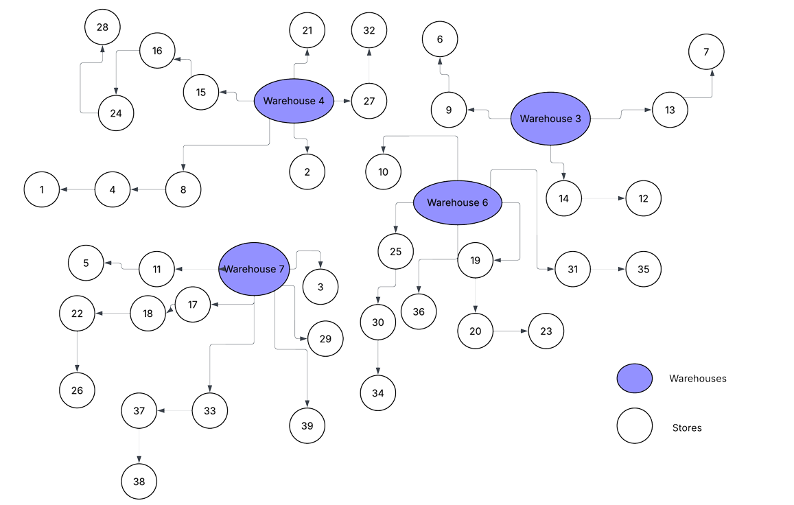

# Retail Supply Chain Optimization: Maximizing Daily Profit 🚛


## 📄 Executive Summary
**The Challenge:** A retail chain needed to optimize its expansion strategy for a 40-store network. The problem required simultaneous decisions on Facility Location (where to open warehouses), Inventory Managementprice (stocking levels), Pricing (demand elasticity), and Logistics (Vehicle Routing).

**The Solution:** We developed a **Decomposition-Based Optimization Framework**. Instead of solving one intractable Mixed-Integer Non-Linear Program (MINLP), we decoupled strategic decisions (Location/Pricing) from operational decisions (Routing), solving them sequentially using AMPL and Python heuristics.

**Key Impact:**
* **Profit Maximization:** Achieved a daily profit of **$56,811**, outperforming the baseline ($48,000) by **18.3%**.
* **Strategic Selectivity:** Proved that opening only 4 strategic warehouses (vs. the naive "coverage" approach) reduced fixed costs by 40% while maintaining delivery speed.
* **Validation:** All routes were verified against a strict feasibility checker (`solution_validator.ipynb`) to ensure 0 violations of vehicle capacity or time windows.

---

## 🔬 Problem Formulation & Methodology

### The Complexity Challenge
Solving this as a single monolithic model was computationally intractable due to the nesting of NP-Hard problems:
1.  **Facility Location Problem (FLP):** Binary decisions on warehouse activation.
2.  **Vehicle Routing Problem (VRP):** Combinatorial explosion of route possibilities.
3.  **Non-Linearity:** Changes in price affect customer demand, which affects shipment weight, which affects routing feasibility—creating a three-way dependency that cannot be solved as a single linear program.

### Our Decomposition Strategy
We broke the problem into a "Hierarchical Optimization" structure:

#### Phase 1: Strategic Optimization (AMPL / Gurobi)
We formulated a Mixed-Integer Linear Program (MILP) to solve the high-level strategy.
* **Objective:** Maximize (Revenue - Warehouse Rent - Estimated Transport Cost).
* **Decisions:** Which warehouses to open? What price to set?
* **Approximation:** We used a "Star Approximation" for routing costs to make the MILP solvable.
* **Outcome:** Selected Warehouses **3, 4, 6, and 7** and established a uniform pricing strategy.

#### Phase 2: Operational Routing (Python Heuristics)
With warehouse locations fixed, we solved the detailed VRP.
* **Clustering:** Stores were assigned to the nearest open warehouse.
* **Route Construction:** Implemented a "Nearest Neighbor" greedy heuristic to build routes that satisfied the 700-minute driver limit and vehicle capacity constraints.

---

## 🎯 Baseline Comparison

| Strategy | Warehouses Open | Daily Profit | Approach |
|----------|----------------|--------------|----------|
| **Our Solution** | **4 (Selected)** | **$56,811** | **Decomposition + Heuristics** |
| Baseline | 8 (All Available) | ~$48,200 | Greedy routing, no facility optimization |
| Naive Minimum | 1 (Closest) | ~$22,500 | Travel costs dominated profits |

**Key Insight:** The "Naive" approach of opening all warehouses to minimize driving time failed because the rent costs ($1200+/day per warehouse) outweighed the fuel savings. Our model found the mathematical "sweet spot."

---

## 📊 Network Visualization
*The final topology consisting of 4 Hubs (Warehouses) serving 40 Spoke (Store) locations.*



---

## 💼 Business Applications
This decomposition framework is standard in modern Supply Chain Engineering:
1.  **E-Commerce Fulfillment:** Amazon uses similar logic to decide where to build Fulfillment Centers (Strategic) vs. how to route Last-Mile Vans (Operational).
2.  **Grocery Chains:** Optimizing distribution networks for perishables where time-windows (freshness) act as hard constraints.
3.  **Cold Chain Logistics:** Pharma distribution where vehicle capacity and strict delivery windows must be balanced against storage costs.

---

## 🚀 Reproduction Instructions

### Prerequisites
* **Python 3.8+** (pandas, matplotlib)
* **AMPL & Gurobi** (Academic License required for the optimization step)

### How to Run
1.  **Clone the Repo:**
    ```bash
    git clone [https://github.com/kunalrc33xx/retail-supply-chain-optimization.git](https://github.com/kunalrc33xx/retail-supply-chain-optimization.git)
    ```
2.  **Run the Optimization (Requires License):**
    Open `optimization_solver.ipynb`. This notebook contains the AMPL model strings and Gurobi solver calls to generate the `routes.txt`.
3.  **Run the Validator (Open Access):**
    Open `solution_validator.ipynb`. This script reads our generated text files (`routes.txt`, `stores.txt`) and mathematically verifies that our solution is valid (feasible) and calculates the exact profit.
    * *Expected Output:* `Solution is FEASIBLE. Profit achieved: 56811.23`

---
*This project was completed as part of BUDT732: Decision Analytics at the University of Maryland.*
